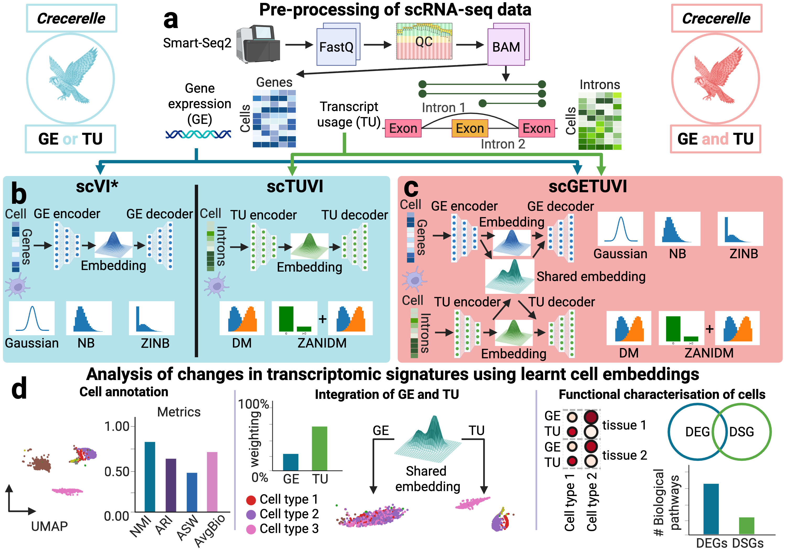

# Crecerelle

This repo contains the processing scripts, code and evaluation methods for the paper XX.



## 📦 Installation

**Via github**:

```bash
git clone git+https://github.com/Hollfelder-Lab/crecerelle.git
cd crecerelle
pip install -e .
```

**Via pip**:

```bash
pip install git+https://github.com/Hollfelder-Lab/crecerelle.git
```

## 🚀 Usage

For data-processing see
[](https://colab.research.google.com/github/Hollfelder-Lab/crecerelle/blob/main_DataProcessing_ClustAssess.ipynb)

For training tuVI see
[](https://colab.research.google.com/github/Hollfelder-Lab/crecerelle/blob/main_Training_scTUVI.ipynb)

For training scVI see
[](https://colab.research.google.com/github/Hollfelder-Lab/crecerelle/blob/main_Training_scVI.ipynb)

For training TRVI see
[](https://colab.research.google.com/github/Hollfelder-Lab/crecerelle/blob/main_Training_scGETUVI.ipynb)

For model selection of tuVI see
[](https://colab.research.google.com/github/Hollfelder-Lab/crecerelle/blob/main_Model_Selection_scTUVI.ipynb)

For model selection of TRVI see
[](https://colab.research.google.com/github/Hollfelder-Lab/crecerelle/blob/main_Model_Selection_scGETUVI.ipynb)

For inference with tuVI and scVI see
[](https://colab.research.google.com/github/Hollfelder-Lab/crecerelle/blob/main_Inference_scTUVI_scVI.ipynb)

For inference with TRVI see
[](https://colab.research.google.com/github/Hollfelder-Lab/crecerelle/blob/main_Inference_scGETUVI.ipynb)

## 🧪 Processed datasets and trained models 

Our data and trained models are available on Zenodo: XX

## 📜 License

This code is licensed under the MIT License - see the [LICENSE](LICENSE) file for details.

## 📃 Citing this work

Please cite our paper if you use this code in your own work:

```bibtex
@article {
 Weberling2026,
 author = {},
 title = {},
 elocation-id = {},
 year = {2026},
 doi = {},
 publisher = {},
 URL = {},
 eprint = {},
 journal = {}
}
```

## 👥 Authors

- [Hollfelder Lab](https://hollfelder.bioc.cam.ac.uk/), Department of Biochemistry, University of Cambridge, UK

## 📧 Contact

For questions, please contact

- fmw37(at)cam.ac.uk
- fh111(at)cam.ac.uk

## 🤝 Contributing

We welcome contributions to Crecerelle, including bug fixes, documentation improvements, tutorials, and new features.

To set up the development environment with Python 3.12:

```bash
git clone https://github.com/Hollfelder-Lab/crecerelle.git
cd crecerelle
chmod +x contribute.sh
./contribute.sh
source .venv/bin/activate
```

If you do not have write access, fork the repository first and clone your fork instead. Submit your changes through a pull request.

See [CONTRIBUTING.md](CONTRIBUTING.md) for the full setup, testing, and submission instructions.


