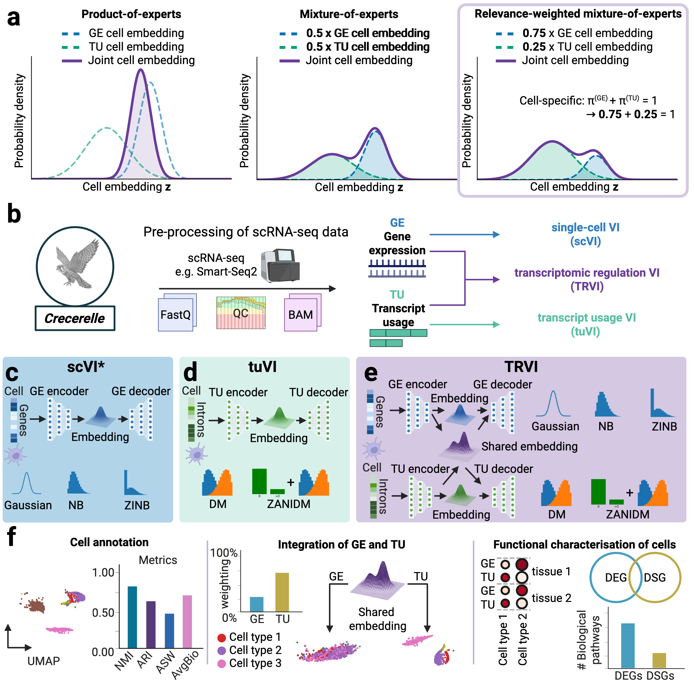

# Crecerelle

Crecerelle is a probabilistic deep learning framework for analysing single-cell gene expression and alternative splicing-induced transcript usage data. Its workflows facilitate data-driven cell annotation, cell-type clustering, differential gene expression analysis, differential splicing analysis, and integrated modelling of gene expression and transcript usage. Hereby, Crecerelle is specifically useful to resolve the contribution of gene expressioun and splicing isoforms for cellular homeostasis, to determine cell-type-specific isoform markers as well as subpopulations with unique isoforms, and to uncover regulatory and disease-associated pathways not detected by gene expression analyses alone
profiles. 

Essential for all workflows are cell emebeddings learnt through three deep generative models:

- transcript usage Variational Inference (tuVI)
- Transricptomic Regulation Variational Inference (TRV)
- single-cell Variational Inference (scVI) (from scvi-tools)

Cell embeddings from single-cell gene expression are learnt through the variational autoencoder scVI whereas tuVI infers cell embeddings purely from alternative splicing-induced transcript usage data. The relevance-weighted mixture-of-experts multimodal variational autoencoder TRVI enables the consolidation of both transcriptomic modalities while resolving the contribution of either facet for a single-cell representation. These deep learning models are implemented via PyTorch, and Crecerelle is published as Python package. 

We provide detailed Colab notebooks as tutorials and to run our workflow pipelines that seamlessly integrate with Scanpy. This documentation renders those notebooks directly with `mkdocs-jupyter`, without manually copying their code, equations, figures, or stored analysis outputs into Markdown.

Use this site to:

- install the package locally or in Colab,
- understand the cell embeddings learnt by tuVI, scVI, and TRVI,
- run the tutorials via Colab,
- reproduce the results from our paper,
- apply the Crecerelle workflows to your own datasets via our Colab notebooks,
- and develop further workflows and models built upon  Crecerelle.

Start with the [tutorial index](tutorials/index.md) to choose the notebook you need, or see [paper reproduction](paper-reproduction.md) for the full workflow order.
